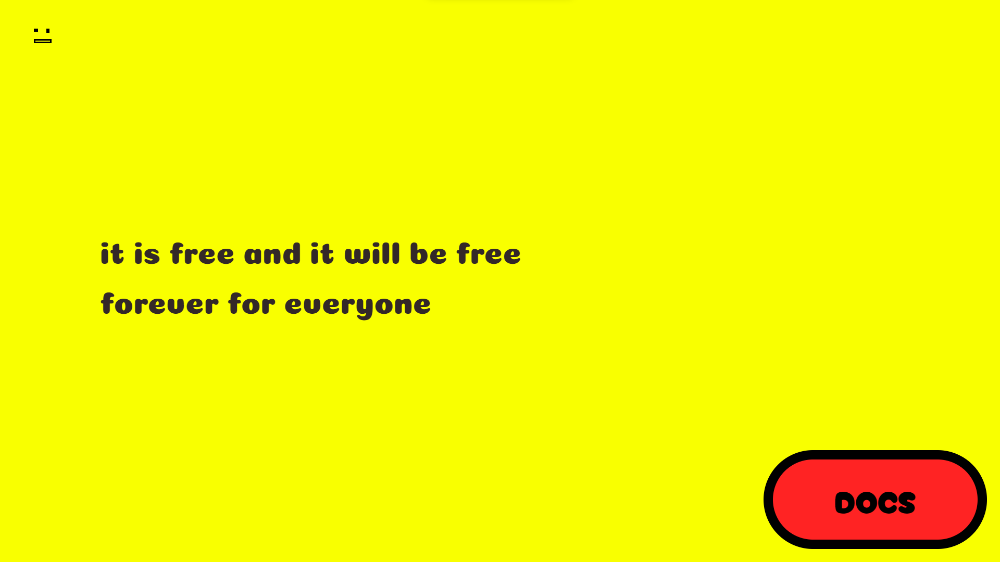

# 📸 Memes API


Welcome to the Memes API! This API allows you to fetch random memes from the internet with a simple GET request. It's perfect for integrating memes into your applications or just for a bit of fun. 🎉

## 🚀 Features

- **Simple GET Requests:** Fetch random memes with ease.
- **Flexible Integration:** Works with any language that can make HTTP requests.
- **Free & Open Source:** Available for everyone to use and contribute.


## 🛠️ Usage

### Make a GET Request

To get a random meme, send a GET request to the following endpoint:

```plaintext
https://memesapi.vercel.app/give
```

### Sample Response

```json
{
  "title": "Funny Meme",
  "url": "https://example.com/funny-meme.jpeg"
}
```

## 💡 Examples


### Using Fetch (JavaScript)

```javascript
fetch('https://memesapi.vercel.app/give')
    .then(response => response.json())
    .then(data => console.log(data));
```

### Using Axios (JavaScript)

```javascript
const axios = require('axios');

axios.get('https://memesapi.vercel.app/give')
    .then(response => console.log(response.data))
    .catch(error => console.error(error));
```

### Using Python (Requests Library)

```python
import requests

response = requests.get('https://memesapi.vercel.app/give')
print(response.json())
```

### Using React

```javascript
import React, { useEffect, useState } from 'react';

function App() {
    const [meme, setMeme] = useState(null);

    useEffect(() => {
        fetch('https://memesapi.vercel.app/give')
            .then(response => response.json())
            .then(data => setMeme(data));
    }, []);

    return (
        <div>
            {meme && }
        </div>
    );
}

export default App;
```

## 🤝 Contributing

We’d love to have your help with the Memes API! Here’s how you can contribute:

1. **Fork the Repo**: Click the "Fork" button at the top right of this page to make a copy of the repository.
2. **Create a Feature**: Add your new feature or fix in your copy of the repo.
3. **Save Your Changes**: Make sure to save and commit your updates.
4. **Share Your Work**: Push your changes to your forked repo.
5. **Open a Pull Request**: Go to the Pull Requests tab and create a new pull request to merge your changes.


For more details, see our [contributing guide](CONTRIBUTING.md).

## 📄 License

This project is licensed under the MIT License - see the [LICENSE](LICENSE) file for details.

## 🌐 Links

- [Official Website](https://memesapi.vercel.app/)
- [GitHub Repository](https://github.com/KrishnaSSH/Memes-API)
- [API Documentation](https://memesapi.vercel.app/docs)

---

Made with ❤️ by [KrishnaSSH](https://github.com/KrishnaSSH)


```License

Creative Commons Attribution 4.0 International License

You are free to:
- Share — copy and redistribute the material in any medium or format
- Adapt — remix, transform, and build upon the material for any purpose, even commercially.

Under the following terms:
- Attribution — You must give appropriate credit, provide a link to the license, and indicate if changes were made. You may do so in any reasonable manner, but not in any way that suggests the licensor endorses you or your use.
- No additional restrictions — You may not apply legal terms or technological measures that legally restrict others from doing anything the license permits.

No warranties are given. The license may not give you all of the permissions necessary for your intended use. For example, other rights such as publicity, privacy, or moral rights may limit how you use the material.


```